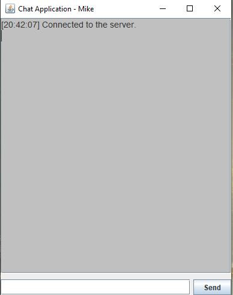

# Java Chat Application
A simple chat application built with Java Swing for the GUI and Java Sockets for the backend server-client communication. The app allows multiple clients to connect to a server and exchange messages in real-time.

## Languages/Frameworks/Database
- Java
- Java Swing: For the graphical user interface
- Java Sockets: For network communication.
- Multithreading: To handle multiple clients on the server.
- I/O Streams: For sending and receiving messages.

## Features
- User-friendly GUI built with Swing.
- Real-time messaging between clients via a centralized server.
- Automatic inclusion of timestamps for each message.
- Unique username for each user.


### Clone the Repository

```bash
git clone https://github.com/Jared-Drake/Java-Chat-App-v2.git
cd compressionTool
```
